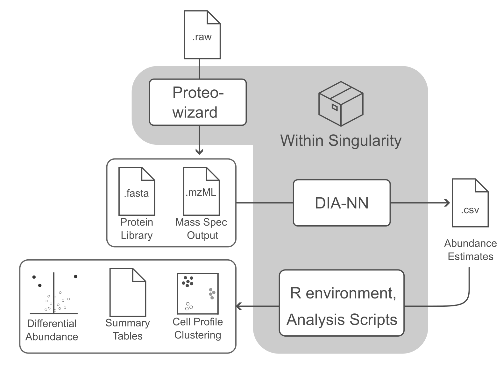

# README



This repository facilitates quick, simple, and reproducible access to Data Independent Acquisition (DIA) proteomics workflows with minimal command line experience.

We include a convenient wrapper script for running DIA-NN inside a pre-built singularity image to first estimate protein abundance from raw mass spec output. Protein abundance estimates (accepting estimates from both `DIA-NN` and `Spectronaut`) can  be processed in a preconfigured R environment, generating QC reports, and various analyses and visualizations.


# Quick-start

1. Ensure `singularity` is installed and accessible on your system. Many HPCs (including NIH Biowulf) come with this pre-installed as a module. If your HPC has singularity installed, it will be automatically detected and loaded when necessary.
2. Clone this repository, i.e. execute `git clone https://github.com/cory-weller/ProtPipe.git`
3. If you are predicting protein abundances from raw mass spec output, look over and edit any custom `DIA-NN` parameters inside [`config.txt`](config.txt). You can either edit `config.txt` directly (and it will be used by default), or make a copy and save it to a different file name, then reference it with `--cfg newfilename.txt` when running the wrapper script.


# Installing Singularity

This workflow requires that [`Singularity`](https://sylabs.io/singularity) be available, which runs natively on a Linux system. `Singularity` is containerization software that allows an entire pre-configured computing environment to be accessed--reducing installation headaches and improving reproducibility. 

*We highly recommend making use a workstation or HPC with a native Linux installation.* Not only does this simplify the usage of `singularity`, it also would likely provide greater resources for DIA-NN's intensive computation.

To run on your personal/local non-Linux machine, Mac users need to first install a number of dependencies. Windows users would either need to use a virtual machine, or run things through the Windows Subsystem for Linux (WSL). Explaining the installation of `singularity` on these non-Linux systems is beyond the scope of this guide, so we defer to [the documentation here](https://docs.sylabs.io/guides/3.0/user-guide/installation.html).

# Predicting Protein Abundances (running DIA-NN)
After editing the contents of [`config.txt`](config.txt), or generating a new file to specify with `--cfg newfile.txt`:
```bash
# Submit to SLURM
sbatch src/diann.sh --cfg config.txt

# Run Locally
src/diann.sh --cfg config.txt
```

# Processing protein intensity estimates

```bash
src/analyze.sh --pgfile output/report.pg_matrix.tsv --design example/design_matrix.csv
```

